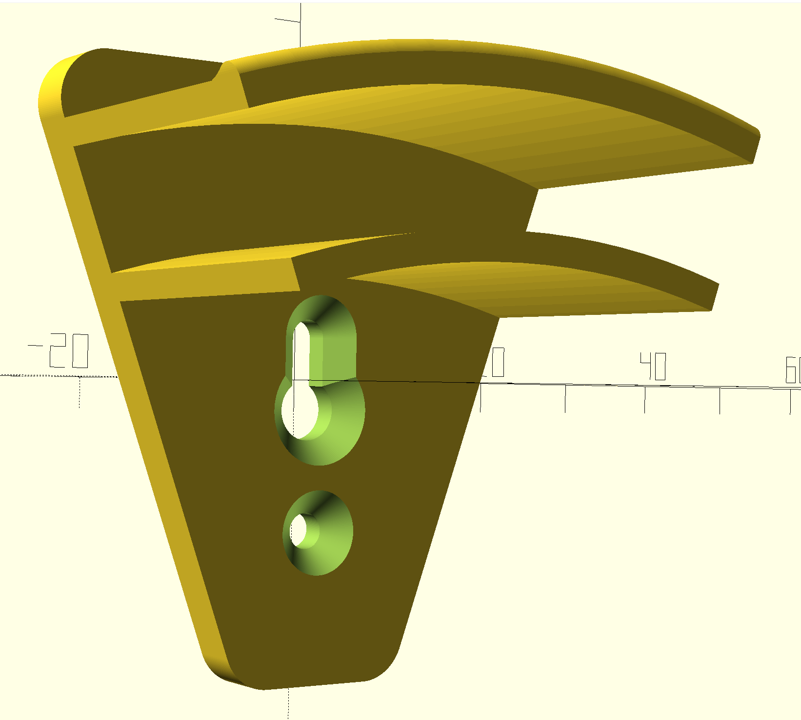

# Cap Wall Mount – Hat Display System

A 3D-printable, parametric wall mount for displaying baseball caps. Fold a cap in half and slide its brim into the channel formed by two concentric arc walls — the cap hangs from a keyhole screw slot on the backplate, with an optional second screw hole below for extra security. The tapered backplate is designed to print on its side so FDM layer lines run along the arc walls for maximum strength. Mount several in a grid on your wall for easy display and selection.

## How It Works

The mount has three main parts:

1. **Backplate** — a flat plate with rounded corners that sits flush against the wall. It includes a keyhole screw slot (and optional bottom screw hole) so you can hang it on a drywall screw.
2. **Arc channel** — two concentric curved walls that extend forward from the backplate. They form a channel sized to hold a folded baseball cap by its brim/edge. The walls have filleted lower edges for smoother cap insertion and removal.
3. **Strap ridge** — a small curved bump on the outer arc wall near the front edge that prevents the cap's adjustable strap from sliding forward and off the mount.
4. **Button cutout** — an arched slot at the apex of the outer wall that gives the cap's top button room to sit without being compressed over time. The cutout tapers wider toward the inside face, letting the button settle naturally into the gap and making it easier to lift the cap off the mount.

## Features

- **Fully parametric** — every dimension is adjustable at the top of the `.scad` file.
- **Designed for strength** — intended to be printed on its side (tapered edge down) so that FDM layer lines run along the length of the arc walls rather than across them. This means the load from the hanging cap is carried in shear along the layers, not in tension across layer bonds — which is the weakest point of any FDM print. The result is arc walls that are far more resistant to snapping under load.
- **Tapered backplate** — the plate narrows toward the bottom at a configurable angle (`plate_taper_angle`, default 20°). This reduces material use and gives you a flat edge to place on the print bed when printing on its side. The angle is a clean multiple of 10° so rotation in the slicer is straightforward.
- **Grid-ready** — mount multiples in rows/columns on a wall.
- **Keyhole mounting** — hang on a single drywall screw; optional second screw hole for extra security.
- **Countersinks** — tapered recesses so screw heads sit flush against the wall.
- **Strap ridge** — keeps the cap's back strap from sliding off.
- **Button cutout** — prevents long-term compression of the cap's top button.
- **Filleted arc walls** — rounded lower edges on the arc walls for smoother cap insertion and removal.

## Customization

Open `cap-wall-mount.scad` in [OpenSCAD](https://openscad.org/) and edit the parameters at the top of the file:

### Backplate

| Parameter | Default | Description |
|---|---|---|
| `plate_width` | 50 mm | Width of the backplate (X axis) |
| `plate_height` | 50 mm | Height of the backplate (Y axis) |
| `plate_thickness` | 4 mm | Thickness of the backplate (Z axis) |
| `plate_corner_radius` | 4 mm | Fillet radius on the plate corners |
| `plate_taper_angle` | 20° | Taper angle from vertical (use a multiple of 10 for easy slicer rotation) |

### Screw Holes

| Parameter | Default | Description |
|---|---|---|
| `screw_holes_enabled` | true | Toggle all screw holes on/off |
| `keyhole_total_height` | 13 mm | Total height of the keyhole slot |
| `keyhole_bottom_diameter` | 8 mm | Diameter of the wide circle (screw head) |
| `keyhole_top_width` | 5 mm | Width of the narrow slot (screw shaft) |
| `keyhole_top_inset` | 20 mm | Distance from plate top edge to keyhole top |
| `bottom_screw_hole_enabled` | true | Toggle the bottom screw hole |
| `bottom_screw_hole_diameter` | 5 mm | Diameter of the bottom screw hole |
| `bottom_screw_hole_offset` | 6 mm | Gap between keyhole bottom and screw hole |
| `countersink_enabled` | true | Toggle countersink tapers on screw holes |
| `countersink_depth` | 2 mm | Depth of the countersink taper |
| `countersink_extra_dia` | 4 mm | Extra diameter of countersink beyond hole |

### Arc Channel

| Parameter | Default | Description |
|---|---|---|
| `arc_radius` | 80 mm | Outer radius of the outer arc wall |
| `arc_sweep` | 38° | Half-sweep angle from apex (total arc = 2×) |
| `arc_wall_thickness` | 2.25 mm | Thickness of each arc wall |
| `arc_channel_gap` | 10 mm | Gap between inner and outer walls (cap fits here) |
| `arc_extrusion` | 25 mm | How far the arcs extend forward from the plate |
| `arc_top_inset` | 2 mm | Distance from plate top edge to arc apex |

### Strap Ridge

| Parameter | Default | Description |
|---|---|---|
| `strap_ridge_enabled` | true | Toggle the strap ridge on/off |
| `strap_ridge_height` | 5 mm | How far the ridge protrudes outward |
| `strap_ridge_width` | 4 mm | Width of the ridge along the Z axis |

## Usage

1. Open `cap-wall-mount.scad` in [OpenSCAD](https://openscad.org/).
2. Adjust parameters at the top of the file to fit your caps and screws.
3. Preview (**F5**) to check the shape, then render (**F6**).
4. Export to STL (**F7**).
5. Slice and print — rotate the model in your slicer so the tapered edge sits flat on the print bed (rotate by `plate_taper_angle`, default 20°). This orients the layer lines along the arc walls for maximum strength.
6. Drive a drywall screw into the wall, hang the mount via the keyhole, and slide a folded cap into the channel.

## License

This project is provided as-is for personal and educational use.
