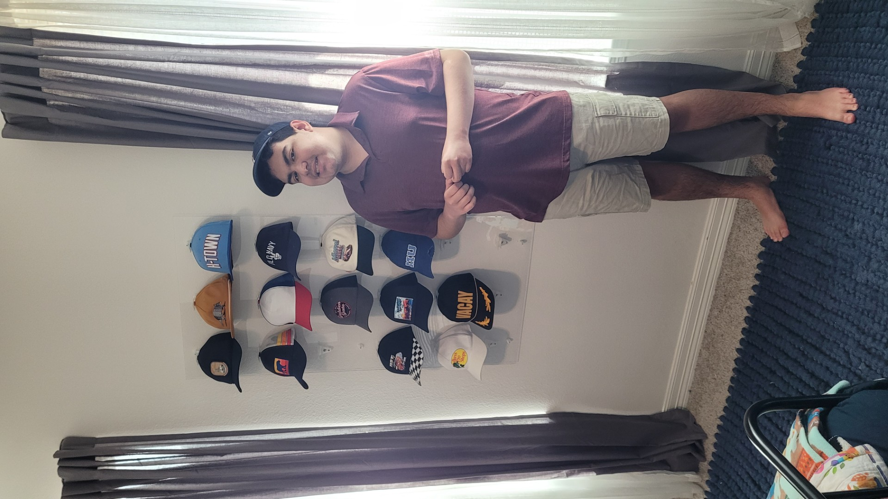

# Cap Wall Mount – Hat Display System

> *Yes, it's a wall hook for hats. No, I didn't need to overthink it this much. But here we are — with optimized layer orientation, parametric everything, and a button cutout so your cap's top button doesn't get squished over the next decade.*

**[Available on MakerWorld](https://makerworld.com/en/models/2529196-baseball-cap-display-mount)**

A 3D-printable, parametric wall mount for displaying baseball caps. Fold a cap in half and slide its brim into the channel formed by two concentric arc walls — the cap hangs from a keyhole screw slot on the backplate, with an optional second screw hole below for extra security. The tapered backplate is designed to print on its side so FDM layer lines run along the arc walls for maximum strength. Mount several in a grid on your wall for easy display and selection.

For a cleaner look, mount the caps on a plexiglass panel and attach the panel to the wall using the included standoff tubes — this creates a floating display of baseball caps.

## Photos

*My son - the baseball cap collector this was designed and printed for. He's the one with the hat habit, not me. If you know him, then you know that is a genuine smile.*

The plexiglass sheet is mounted to the wall using six standoff spacers (included in this repo) and six 3″ wood screws. The cap mounts are secured to the plexiglass with #6 bolts, nuts, and washers.

More photos are available in the [images](images/) folder.

## How It Works

The mount has four main parts:

1. **Backplate** — a flat plate with rounded corners that sits flush against the wall. It includes a keyhole screw slot (and optional bottom screw hole) so you can hang it on a drywall screw.
2. **Arc channel** — two concentric curved walls that extend forward from the backplate. They form a channel sized to hold a folded baseball cap by its brim/edge. The walls have filleted lower edges for smoother cap insertion and removal.
3. **Strap ridge** — the ridge on the top arc lets you hang a cap by its back strap if you don't care about the cap facing outward. If you prefer this style, you can set `inner_arc_enabled` to `false` since the inner arc wall isn't needed. On the outer arc wall near the front edge, a small curved bump prevents the cap's adjustable strap from sliding forward and off the mount.
4. **Button cutout** — an arched slot at the apex of the outer wall that gives the cap's top button room to sit without being compressed over time. The cutout tapers wider toward the inside face, letting the button settle naturally into the gap and making it easier to lift the cap off the mount.

## Features

- **Fully parametric** — every dimension is adjustable at the top of the `.scad` file.
- **Designed for strength** — intended to be printed on its side (tapered edge down) so that FDM layer lines run along the length of the arc walls rather than across them. This means the load from the hanging cap is carried in shear along the layers, not in tension across layer bonds — which is the weakest point of any FDM print. The result is arc walls that are far more resistant to snapping under load.
- **Tapered backplate** — the plate narrows toward the bottom at a configurable angle (`plate_taper_angle`, default 20°). This reduces material use and gives you a flat edge to place on the print bed when printing on its side. The angle is a clean multiple of 10° so rotation in the slicer is straightforward.
- **Grid-ready** — mount multiples in rows/columns on a wall.
- **Keyhole mounting** — hang on a single drywall screw; optional second screw hole for extra security.
- **Countersinks** — tapered recesses so screw heads sit flush against the wall.
- **Strap ridge** — keeps the cap's back strap from sliding off.
- **Inner arc ridge** — a small bump on the inner wall that helps hold the cap brim in the channel.
- **Button cutout** — prevents long-term compression of the cap's top button.
- **Filleted arc walls** — rounded lower edges on the arc walls for smoother cap insertion and removal.

## Customization

Open `src/cap-wall-mount.scad` in [OpenSCAD](https://openscad.org/) and edit the parameters at the top of the file:

### Backplate

| Parameter | Default | Description |
|---|---|---|
| `plate_width` | 45 mm | Width of the backplate (X axis) |
| `plate_height` | 50 mm | Height of the backplate (Y axis) |
| `plate_thickness` | 3 mm | Thickness of the backplate (Z axis) |
| `plate_corner_radius` | 4 mm | Fillet radius on the plate corners |
| `plate_taper_angle` | 20° | Taper angle from vertical (use a multiple of 10 for easy slicer rotation) |

### Screw Holes

| Parameter | Default | Description |
|---|---|---|
| `screw_holes_enabled` | true | Toggle all screw holes on/off |
| `keyhole_total_height` | 13 mm | Total height of the keyhole slot |
| `keyhole_bottom_diameter` | 8.5 mm | Diameter of the wide circle (screw head) |
| `keyhole_top_width` | 4 mm | Width of the narrow slot (screw shaft) |
| `keyhole_top_inset` | 21 mm | Distance from plate top edge to keyhole top |
| `bottom_screw_hole_enabled` | true | Toggle the bottom screw hole |
| `bottom_screw_hole_diameter` | 4 mm | Diameter of the bottom screw hole |
| `bottom_screw_hole_offset` | 6 mm | Gap between keyhole bottom and screw hole |
| `countersink_enabled` | true | Toggle countersink tapers on screw holes |
| `countersink_depth` | 2 mm | Depth of the countersink taper |
| `countersink_extra_dia` | 4 mm | Extra diameter of countersink beyond hole |

### Arc Channel

| Parameter | Default | Description |
|---|---|---|
| `inner_arc_enabled` | true | Toggle the inner arc wall on/off |
| `arc_radius` | 80 mm | Outer radius of the outer arc wall |
| `arc_sweep` | 38° | Half-sweep angle from apex (total arc = 2×) |
| `arc_wall_thickness` | 2.25 mm | Thickness of each arc wall |
| `arc_channel_gap` | 9 mm | Gap between inner and outer walls (cap fits here) |
| `outer_arc_extrusion` | 25 mm | How far the outer arc extends forward from the plate |
| `inner_arc_extrusion` | 20 mm | How far the inner arc extends forward from the plate |
| `arc_top_inset` | 2 mm | Distance from plate top edge to arc apex |
| `arc_wall_fillet` | 1.1 mm | Fillet radius on arc wall cross-section corners |

### Strap Ridge

| Parameter | Default | Description |
|---|---|---|
| `strap_ridge_enabled` | true | Toggle the strap ridge on/off |
| `strap_ridge_height` | 7 mm | How far the ridge protrudes outward |
| `strap_ridge_width` | 4 mm | Width of the ridge along the Z axis |

### Inner Arc Ridge

| Parameter | Default | Description |
|---|---|---|
| `inner_ridge_enabled` | true | Toggle the inner arc ridge on/off |
| `inner_ridge_height` | 1 mm | How far the ridge protrudes into the channel |
| `inner_ridge_width` | 3 mm | Width of the inner ridge along the Z axis |

### Button Cutout

| Parameter | Default | Description |
|---|---|---|
| `button_cutout_enabled` | true | Toggle the button cutout on/off |
| `button_cutout_width` | 17 mm | Width of the cutout in X |
| `button_cutout_height` | 15 mm | Height of the cutout from the plate surface in Z |

## Standoff Tube (`src/standoff-tube.scad`)

A simple cylindrical spacer tube sized for standard drywall screws. It sits between the plexiglass panel and the wall, holding the panel away from the wall surface to provide clearance for the screws that secure the cap mounts to the plexiglass. Drive a drywall screw through the plexiglass, through the standoff, and into the wall — the cap wall mounts are then attached to the front of the plexiglass, creating a floating display panel.

| Parameter | Default | Description |
|---|---|---|
| `inner_diameter` | 5.4 mm | Bore diameter (sized for your screw shaft) |
| `wall_thickness` | 4 mm | Radial wall thickness |
| `length` | 16 mm | Total tube length (standoff distance from wall) |
| `flat_edge` | false | Adds a flat along the length of the tube for printing on its side |

When `flat_edge` is enabled, the tube can be printed on its side so that FDM layer lines run axially along the tube length. This orients the layers parallel to the compressive load path between the wall and the plexiglass, maximising interlaminar shear strength and eliminating the risk of delamination under clamping force — the weakest failure mode when layers are perpendicular to the load.

## Usage

1. Open `src/cap-wall-mount.scad` in [OpenSCAD](https://openscad.org/).
2. Adjust parameters at the top of the file to fit your caps and screws.
3. Preview (**F5**) to check the shape, then render (**F6**).
4. Export to STL (**F7**).
5. Slice and print — rotate the model in your slicer so the tapered edge sits flat on the print bed (rotate by `plate_taper_angle`, default 20°). This orients the layer lines along the arc walls for maximum strength.
6. Drive a drywall screw into the wall, hang the mount via the keyhole, and slide a folded cap into the channel.

## Repository Layout

- `src/` — Editable OpenSCAD source/design files.
- `publication/` — Exported STL files ready for publishing.
- `images/` — Screenshots and renders.

## License

This project is licensed under the [MIT License](LICENSE).
